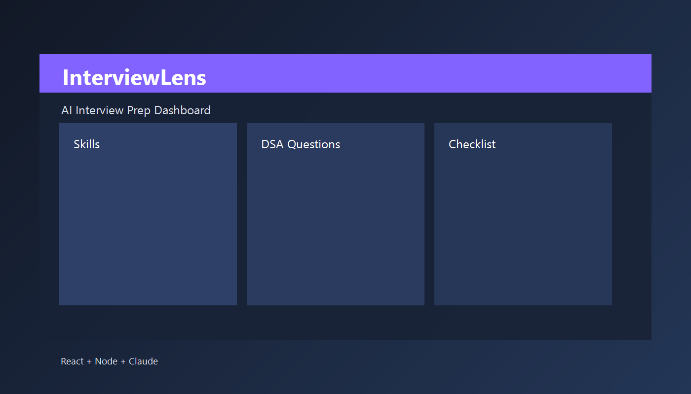

# InterviewLens

InterviewLens is a full-stack AI interview preparation app.
Paste a job description and get a complete prep kit with extracted skills, tailored DSA and behavioral questions, resume keywords, and a focused checklist.

## Screenshot



## Features

- AI-powered job description analysis (Claude)
- Technical and soft skill extraction
- Tailored DSA question set with difficulty tags
- Behavioral interview questions
- Resume keyword suggestions
- Personalized prep checklist
- Mock interview flashcard mode
- Auth + saved analysis history

## Tech Stack

- Frontend: React, Vite, Tailwind CSS, Framer Motion
- Backend: Node.js, Express, MongoDB (Mongoose)
- AI: Anthropic Claude API
- Auth: JWT + bcrypt

## Project Structure

```text
interview lelo/
  client/   # React frontend
  server/   # Express API + MongoDB models
```

## Setup

1. Install dependencies

```bash
cd client && npm install
cd ../server && npm install
```

2. Create environment file

Copy `server/.env.example` to `server/.env` and fill values.

3. Run backend

```bash
cd server
npm run dev
```

4. Run frontend

```bash
cd client
npm run dev
```

Frontend runs on `http://localhost:5173` and backend on `http://localhost:5000`.

## Environment Variables (`server/.env`)

- `PORT=5000`
- `MONGO_URI=your_mongodb_connection_string`
- `ANTHROPIC_API_KEY=your_anthropic_api_key`
- `JWT_SECRET=a_long_random_secret`
- `CLIENT_URL=http://localhost:5173`

## API Endpoints

- `POST /api/analyze` - Analyze job description
- `POST /api/auth/register` - Register user
- `POST /api/auth/login` - Login user
- `GET /api/history` - Fetch saved analyses
- `GET /api/health` - Health check
